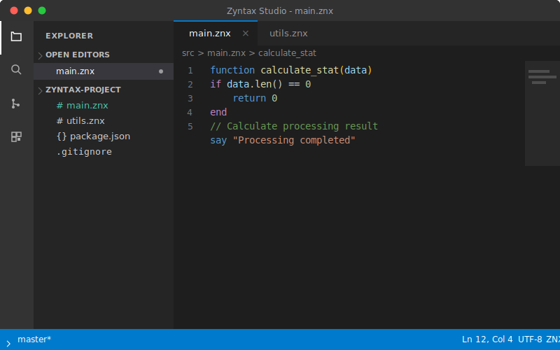
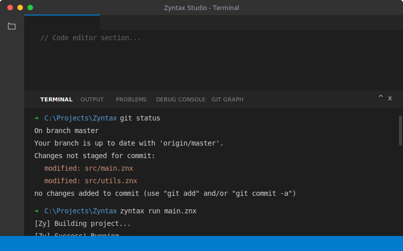
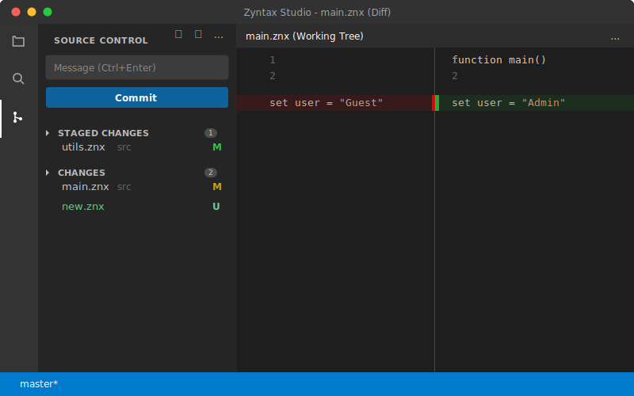
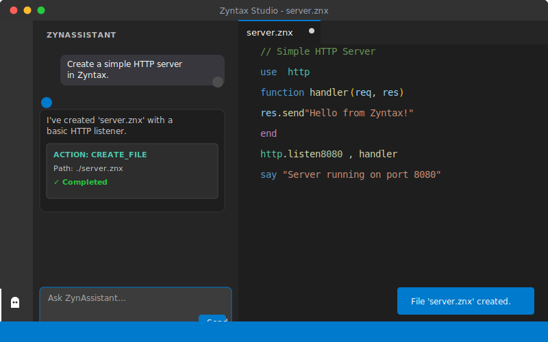
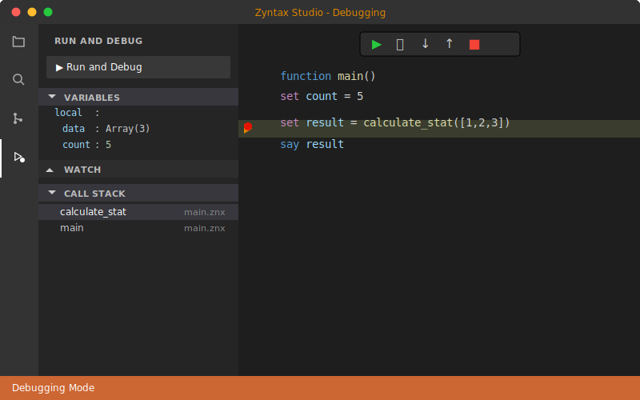

  

  # Zyntax Studio
  
  **The Official Integrated Development Environment for the Zyntax Language.**
  
  
  
  
  
  
  

  

    <a href="#gallery">Gallery</a> •
    <a href="#features">Features</a> •
    <a href="#installation">Installation</a> •
    <a href="#roadmap">Roadmap</a> •
    <a href="#contributing">Contributing</a>
  

---

## Overview

**Zyntax Studio Pro** is a modern, AI-powered IDE built specifically to supercharge your **Zyntax** development workflow. It delivers a premium, native coding experience with deep language integration and autonomous assistance.

Unlike generic text editors, Zyntax Studio understands your code. From intelligent syntax highlighting to direct script execution and an embedded AI coding companion, every feature is designed to make writing Zyntax faster and error-free.

## Gallery

  
  
<em>The intuitive, dark-themed workspace designed for focus.</em>

  <table border="0">
    <tr>
      <td width="50%" align="center">
        
         <strong>Integrated Zyntax Terminal</strong>
      </td>
      <td width="50%" align="center">
        
         <strong>Built-in Source Control</strong>
      </td>
    </tr>
    <tr>
      <td width="50%" align="center">
        
         <strong>ZynAssistant AI</strong>
      </td>
      <td width="50%" align="center">
        
         <strong>Advanced Debugging</strong>
      </td>
    </tr>
  </table>

## Features

### Zyntax Intelligence (LSP)
- **Native Support**: First-class citizen support for `.znx` files.
- **Smart Autocomplete**: Context-aware suggestions for functions, keywords (`say`, `if`, `function`), and snippets.
- **Go to Definition (F12)**: Jump instantly to the source of any function, even across imported modules.
- **Syntax Highlighting**: Beautiful, readable color coding for improved clarity.

### ZynAssistant (AI-Powered)
- **Integrated AI**: Chat with ZynAssistant directly in the sidebar to generate code, refactor logic, or fix bugs.
- **ZAgent (Auto-Builder)**: A mission-driven autonomous agent that can plan and build entire projects from scratch, handling file creation and command execution automatically.
- **AI Image Generation**: Generate stunning visual assets (flux, zimage, imagen-4) directly within the chat for your UI/UX needs.
- **Agentic Capabilities**: The AI can Create Files, Read Directories, and Execute Commands (with your permission).
- **Infinite Resilience**: Automatic model rotation and smart retry logic ensures the AI stays online even during service outages.

### Power Tools
- **Integrated Terminal**: Execute `run` commands and python scripts directly without leaving the IDE.
- **ZPM (Zyntax Package Manager)**: Browse and install community extensions from the sidebar.
- **File Explorer**: Drag-and-drop file management, folder creation, and workspace organization.

### Developer Experience
- **Git Integration**: View changes, stage files, commit, and push directly from the sidebar.
- **Customizable**: Tweak settings for font size, theme, and AI personality.
- **Project Workspaces**: Open folders as projects with persistent state.

## Installation

### Windows
1. Download the latest `.exe` from the [Releases Page](https://github.com/ZyntaxFoundation/zyntax-studio/releases).
2. Run the installer.
3. Start coding in Zyntax!

## Roadmap

- [x] Basic Syntax Highlighting
- [x] File System Integration
- [x] Integrated Terminal
- [x] ZynAssistant AI Agent (Conversational + Actions)
- [x] Git Support (Diff View, Commit, Push/Pull)
- [x] Zyntax LSP (Autocompletion + Go to Definition)
- [x] **ZAgent**: Autonomous Auto-Builder Mission system.
- [x] **Image Gen**: AI-powered asset generation.
- [x] **ZPM**: Extension Marketplace UI.
- [ ] **Live Preview**: Real-time HTML/Web rendering side-by-side.

## Contributing

We welcome contributions! Please see our [Contributing Guide](CONTRIBUTING.md) for details.

1. Fork the Project
2. Create your Feature Branch (`git checkout -b feature/AmazingFeature`)
3. Commit your Changes (`git commit -m 'Add some AmazingFeature'`)
4. Push to the Branch (`git push origin feature/AmazingFeature`)
5. Open a Pull Request

## License

Distributed under the MIT License. See `LICENSE` for more information.

---

  Built with ❤️ by the Zyntax Foundation.

